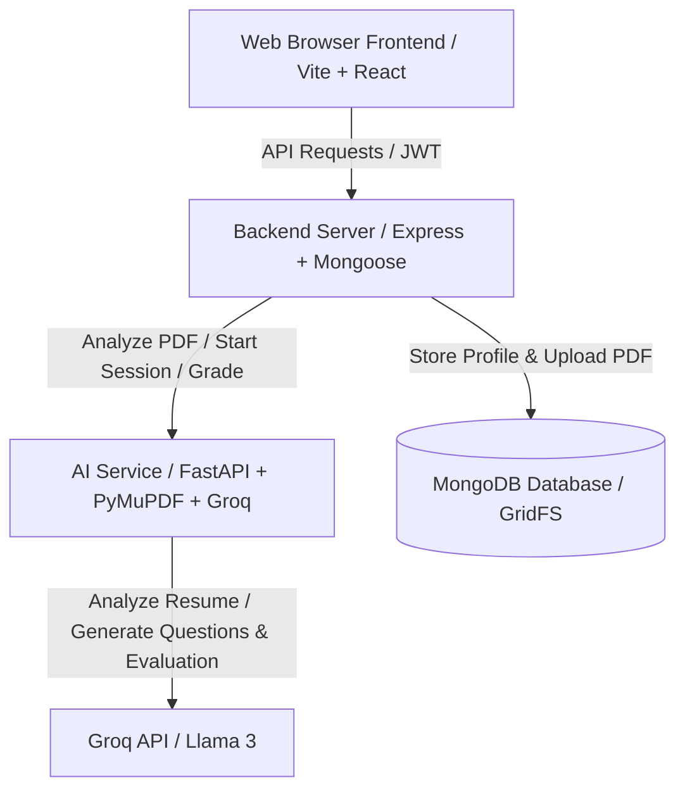

# Smart AI Mock Interview Platform 🚀

**DEPI Graduation Project**

An advanced, production-grade AI-powered Mock Interview Platform. It parses CVs using semantic AI analysis, simulates realistic voice-interactive interview sessions, provides detailed coaching evaluations, and saves structured session history.

---

## 🌟 Key Features

* **Smart CV Parsing**: Extracts structured profile data (skills, highlights, work history) from PDF resumes using PyMuPDF and LLMs.
* **Continuous Voice Interview Engine**: Real-time speech-to-text (STT) and text-to-speech (TTS) via the Web Speech API. Features continuous microphone capture so candidates can speak naturally with brief pauses.
* **AI Interviewer Muting**: A speaker mute toggle button on the meeting controls allowing candidates to silence the AI's reading voice at any time.
* **Granular Scorecards & AI Coaching**: Each question is graded (1-10) with detailed strengths, improvement lists, and conversational AI Coach advice.
* **Structured Sessions History**: Stores past interview history in MongoDB. Features an interactive dashboard on the Candidate Profile page with expandable cards showing full dialog history, scores, strengths, improvements, and coach replies.
* **Dynamic CORS & Production-ready API Proxying**: Out-of-the-box configurations supporting seamless integration between Vercel and Railway in production while preserving simple localhost defaults.

---

## 🏗️ Architecture



---

## 🛠️ Technology Stack

* **Frontend**: React, Vite, Vanilla CSS (Glassmorphic design, animations, theme toggling)
* **Backend**: Node.js, Express, Mongoose (MongoDB + GridFS for file uploads)
* **AI Service**: Python, FastAPI, PyMuPDF (PDF text extraction), Groq SDK
* **Speech Engine**: Web Speech API (`SpeechRecognition` & `SpeechSynthesis`)

---

## 📁 Repository Structure

```text
├── AI-Service/           # FastAPI application containing LLM prompting and PDF parsing
├── Backend/              # Express.js REST API managing Authentication, DB profiles & file uploads
├── frontend/             # React/Vite web application containing the user interface
├── vercel.json           # Vercel configuration for API rewrites (repository root)
└── README.md             # Project documentation (this file)
```

---

## 🚀 Local Installation & Running

Follow these steps to run the stack locally. Run each service in separate terminals.

### 1. AI-Service Setup (FastAPI)
1. Navigate to the folder:
   ```bash
   cd AI-Service
   ```
2. Create and activate a Python virtual environment:
   ```bash
   python -m venv .venv
   # On Windows:
   .venv\Scripts\activate
   # On macOS/Linux:
   source .venv/bin/activate
   ```
3. Install dependencies:
   ```bash
   pip install -r requirements.txt
   ```
4. Create an `.env` file in `/AI-Service/` matching `.env.example`:
   ```env
   GROQ_API_KEY=your_groq_api_key
   GROQ_MODEL=llama-3.1-8b-instant
   ```
5. Run the FastAPI server:
   ```bash
   uvicorn main:app --reload --host 0.0.0.0 --port 8000
   ```

### 2. Backend Setup (Express)
1. Navigate to the folder:
   ```bash
   cd Backend
   ```
2. Install dependencies:
   ```bash
   npm install
   ```
3. Create an `.env` file in `/Backend/` matching `.env.example`:
   ```env
   PORT=5000
   MONGODB_URI=your_mongodb_connection_string
   JWT_SECRET=your_jwt_signing_key_secret
   AI_SERVICE_URL=http://localhost:8000
   FRONTEND_URL=http://localhost:5173
   ```
4. Run the Express dev server:
   ```bash
   npm run dev
   ```

### 3. Frontend Setup (React/Vite)
1. Navigate to the folder:
   ```bash
   cd frontend
   ```
2. Install dependencies:
   ```bash
   npm install
   ```
3. Run the development build:
   ```bash
   npm run dev
   ```
4. Open the web interface at `http://localhost:5173`.

---

## ☁️ Production Deployment Guide

### A. Deploy Express Backend & AI-Service (Railway)
1. Create a service for your Python FastAPI backend, pointing the deploy settings to the `/AI-Service` subdirectory. Add `GROQ_API_KEY` to the environment.
2. Create a service for your Express backend using the `/Backend` directory. Railway will automatically pick up the provided [railway.json](file:///a:/DEPI/Depi/Backend/railway.json) and [Procfile](file:///a:/DEPI/Depi/Backend/Procfile).
3. Set your environment variables in the Express service dashboard:
   * `MONGODB_URI` (Your MongoDB Atlas connection string)
   * `JWT_SECRET` (A strong random string)
   * `AI_SERVICE_URL` (URL of your deployed FastAPI AI service on Railway)
   * `FRONTEND_URL` (`https://smart-virtual-interview.vercel.app`)

### B. Deploy Frontend (Vercel)
1. Create a new project on Vercel and import your repository.
2. Set the Root Directory to `/frontend`.
3. Add the following Environment Variable in your Vercel project settings:
   * **Key**: `VITE_API_URL`
   * **Value**: Your public Railway backend URL (e.g. `https://smart-virtual-interview-production.up.railway.app`)
4. Click Deploy. Vercel will build the frontend and edge-proxy all `/api/*` traffic automatically using the pre-configured [vercel.json](file:///a:/DEPI/Depi/vercel.json) rewrite rule.

---

## 🎯 Evaluation Guidelines

When evaluating a candidate's answer during a mock interview session, the AI Coach uses the following instructions:
* **Targeted Scoring**: Grades each response from `1` (poor) to `10` (excellent) based on accuracy, relevance, and role expectations.
* **CV-Grounding**: Cross-references the answer against the candidate's CV profile to gauge the seniority and practical depth expected.
* **Actionable Feedback**: Pinpoints up to **3 key strengths** (e.g., solid framework usage, good example structure) and **3 areas for improvement** (e.g., missing metrics, lack of impact statement).
* **Coaching Tone**: Delivers supportive but realistic guidance to help the candidate adjust their presentation style and content for real-world interviews.
